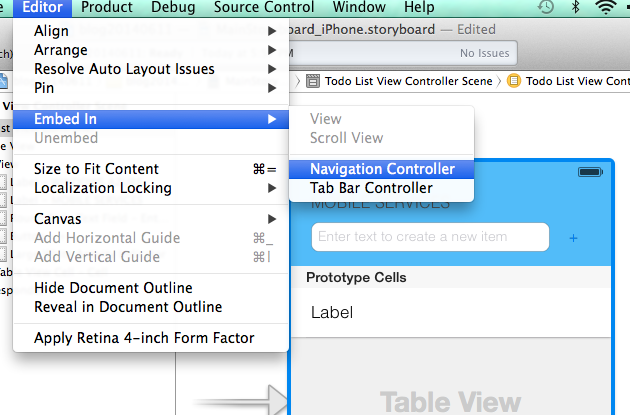

#Offline support in the Azure Mobile Services iOS SDK

We’ve just released a preview version of the Azure Mobile Services SDK for iOS with offline support. Like the offline support in the .NET SDK, we're releasing a preview version of the offline so that we can get feedback to (from you!) to make sure that we release this feature in a way that will suit your applications.

To present the new feature in the SDK, we'll walk through the steps to make our sample Todo app offline-enabled. We'll be talking about the features as they are needed for the app.

## Initial setup

To start off the walkthough, let's use the quickstart application that you can download in the portal. Create a new mobile service (for this example, let's use the node.js backend, which can be set up quicker than the .NET one.

Once the service is created, download the iOS quickstart to your Mac.

Open it in Xcode and we're ready to add offline support to it. We're now ready to start playing with it.

## Updating the quickstart app

The offline support we're previewing here has some nice features. One of them is the ability to resolve conflicts which can happen when pushing the local changes to the table in Azure. For example, if you're running the same app in two phones, and changed *the same* item in both phones locally, when you're ready to push the changes back to the server one of them will fail with a conflict. The SDK allows you to deal with those conflicts via code, and decide what to do with the item which has a conflict.

The current quickstart, however, doesn't really have many occasions where conflicts can arise, since the only action we can take for an item is to mark it as complete. True, we can mark the item as complete in one client and then do the same in another client, but although technically this is a conflict (and the framework will flag it as such) it's not too interesting. Let's then change the quickstart to make it more interesting by allowing full editing of the todo items.

*Note: if you don't want to walk through the modification of the todo item app, feel free to jump directly to the next section ("Updating the framework")*

### Preparing the navigation view

I'll show here the changes for the iPhone storyboard, but the same would apply for the iPad as well. Open the quick start in Xcode and select the MainStoryboard_iPhone.storyboard file. Once in there, select the main view controller, and on the Editor menu, select "Embed In", "Navigation Controller".

Next, select the table view cell in the Todo List View Controller and in the properties window set the Accessory mode to be "Disclosure Indicator"

### Adding the details view controller

There are some cosmetic changes which I'll make but I'll skip them here for brevity of this post. Next, add a new view controller class which will back the details view controller which we'll add to the storyboard. Add a new Objective-C class called QSTodoItemViewController, derived from UIViewController to your project, and add a property of type NSMutableDictionary which will hold the item to be modified.

    @interface QSTodoItemViewController : UIViewController <UITextFieldDelegate>

    @property (nonatomic, weak) NSMutableDictionary *item;

    @end

In the implementation (.m) file, add two private properties corresponding to the fields of the todo item which we'll edit:

    @interface QSTodoItemViewController ()

    @property (nonatomic, strong) IBOutlet UITextField *itemText;
    @property (nonatomic, strong) IBOutlet UISegmentedControl *itemComplete;

    @end

    @implementation QSTodoItemViewController

    - (id)initWithNibName:(NSString *)nibNameOrNil bundle:(NSBundle *)nibBundleOrNil
    {
        self = [super initWithNibName:nibNameOrNil bundle:nibBundleOrNil];
        if (self) {
            // Custom initialization
        }
        return self;
    }

    - (void)viewDidLoad
    {
        [super viewDidLoad];

        UINavigationItem *nav = [self navigationItem];
        [nav setTitle:@"Todo Item"];

        NSDictionary *theItem = [self item];
        [self.itemText setText:[theItem objectForKey:@"text"]];

        BOOL isComplete = [[theItem objectForKey:@"complete"] boolValue];
        [self.itemComplete setSelectedSegmentIndex:(isComplete ? 0 : 1)];

        [self.itemComplete addTarget:self
                              action:@selector(completedValueChanged:)
                    forControlEvents:UIControlEventValueChanged];
    }

    - (void)completedValueChanged:(id)sender {
        [[self view] endEditing:YES];
    }

    - (void)viewWillDisappear:(BOOL)animated {
        [self.item setValue:[self.itemText text] forKey:@"text"];
        [self.item setValue:[NSNumber numberWithBool:self.itemComplete.selectedSegmentIndex == 0] forKey:@"complete"];
    }

    - (void)didReceiveMemoryWarning
    {
        [super didReceiveMemoryWarning];
        // Dispose of any resources that can be recreated.
    }

    - (BOOL)textFieldShouldEndEditing:(UITextField *)textField {
        [textField resignFirstResponder];
        return YES;
    }

    - (BOOL)textFieldShouldReturn:(UITextField *)textField {
        [textField resignFirstResponder];
        return YES;
    }

    @end

Now return to the storyboard and add a new view controller to the right of the list view. In the identity inspector, select the class added below as the custom class for the view controller. Then add a new push segue from the table cell in the master view controller to the detail view controller, naming the segue "detailSegue". Add the appropriate fields in the view controller (a text field for the item text; a segmented control for the complete status) and link them to the outlets in the class.

At this point you should be able to run the app and when selecting an item in the table, it will show the (currently empty) details view controller.

### Filling data

## Updating the framework

Download alpha version of our framework from some TBD link

## Setting up CoreData

The boilerplate code

## Defining the model

Instructions on building the model. Copy the existing model (from the framework zip file), and update it to add the TodoItem entity.

## From table to sync table

Just like in the managed case, we make a simple change in the code - instead of using MSTable, we start using MSSyncTable (from `[client tableWithName:]` to `[client syncTableWithName:]`).

## Pulling and pushing

At this point we have a "pure offline" solution, so we need to start exchanging data between the local and the remote tables. That is accomplished via pull and push operations, and this is how we do it...

## Threading considerations

Here's where we talk about dispatching results to the main (UI) thread, given that we used a background managed object queue. 

## Conflict handling

Edits in two different places, how can we handle that in the client?

## Wrapping up

We're now adding offline support for native iOS applications, and like in the managed SDK, we're releasing it in a preview format. We really appreciate your feedback so we can continue improving in the SDKs for Azure Mobile Services. As usual, please leave comments / suggestions / questions in this post, or in or [MSDN Forum](http://social.msdn.microsoft.com/Forums/windowsazure/en-US/home?forum=azuremobile).